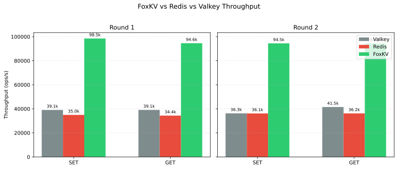

# FoxKV

<p align="center">
  <a href="LICENSE"></a>
  
</p>

<p align="center">
  <a href="https://github.com/gutsola/foxkv/releases"></a>
  <a href="https://github.com/gutsola/foxkv/actions"></a>
</p>

<p align="center">
  <b>🚀 A Redis-compatible in-memory key-value store in Rust, delivering 2–3x Redis throughput</b>
</p>

<p align="center">
  <a href="#features">Features</a> •
  <a href="#quick-start">Quick Start</a> •
  <a href="#installation">Installation</a> •
  <a href="#documentation">Documentation</a> •
  <a href="#benchmarks">Benchmarks</a> •
  <a href="#contributing">Contributing</a>
</p>

<p align="center">
  <b>English</b> | <a href="docs/zh-CN/README.md">中文</a>
</p>

***

## ✨ Features

- **🔌 Redis Protocol Compatible**: Drop-in replacement for Redis, supports all standard Redis clients
- **⚡ High Performance**: Built with Rust and Tokio for maximum throughput and low latency
- **📊 Rich Data Types**: String, Hash, List, Set, Sorted Set with full command support
- **💾 Persistence**: AOF (Append-Only File) and RDB snapshot support
- **🔄 Replication**: Master-replica replication for high availability
- **🔒 ACL Support**: Access Control Lists for fine-grained security
- **☁️ Cloud Native**: Easy deployment with Docker and Kubernetes

## 🚀 Quick Start

### Using Cargo

**Prerequisites:**

- Rust 1.91+ (Install from [rustup.rs](https://rustup.rs))

**Quick Start:**

```bash
# Clone the repository
git clone https://github.com/gutsola/foxkv.git
cd foxkv

# Build and run
cargo run --release --bin foxkv

# Run as replica node
cargo run --release --bin foxkv -- --config replica.conf

# Run with debug logging
RUST_LOG=debug cargo run --release --bin foxkv
```

**Environment Variables:**

| Variable   | Description                              | Default |
| ---------- | ---------------------------------------- | ------- |
| `RUST_LOG` | Log level (e.g., `debug`, `info`, `warn`) | `info`  |

FoxKV uses `env_logger` for logging. Set `RUST_LOG=debug` to enable debug logs.

**Build Release Binary:**

```bash
# Build release binary
cargo build --release --bin foxkv

# Binary will be at: target/release/foxkv
```

**Platform-Specific Builds:**

*Windows:*

```powershell
cargo run --release --bin foxkv
```

*Windows → Linux (musl cross-compile):*

```powershell
$env:RUSTFLAGS='-Clinker=rust-lld'; cargo build --release --bin foxkv --target x86_64-unknown-linux-musl
```

**Configuration:**

Specify a configuration file using the `--config` option:

```bash
./foxkv --config /path/to/redis.conf
```

If no config file is specified, FoxKV will:
1. Check if `redis.conf` exists in the current directory
2. Load it if present
3. Otherwise use default settings

### Using Docker

**Quick Start:**

```bash
# Run with Docker
docker run -d --name foxkv -p 6379:6379 gutsola/foxkv:latest
```

## 💡 Usage Examples

### Connect with Redis CLI

```bash
# FoxKV runs on port 6379 by default
redis-cli -p 6379

# Test the connection
127.0.0.1:6379> PING
PONG

# Set and get a key
127.0.0.1:6379> SET mykey "Hello FoxKV"
OK
127.0.0.1:6379> GET mykey
"Hello FoxKV"
```

### String Operations

```bash
redis-cli -p 6379

# Basic string operations
SET user:1 "Alice"
GET user:1
APPEND user:1 " Smith"
STRLEN user:1

# Numeric operations
SET counter 100
INCR counter
INCRBY counter 50
DECR counter
```

## 🏗️ Architecture

```
┌─────────────────────────────────────────────────────────┐
│                    FoxKV Architecture                   │
├─────────────────────────────────────────────────────────┤
│                                                         │
│  ┌─────────────┐    ┌─────────────┐    ┌─────────────┐ │
│  │   Client    │    │   Client    │    │   Client    │ │
│  │  (Redis)    │    │  (Redis)    │    │  (Redis)    │ │
│  └──────┬──────┘    └──────┬──────┘    └──────┬──────┘ │
│         │                  │                  │        │
│         └──────────────────┼──────────────────┘        │
│                            │                          │
│  ┌─────────────────────────┴─────────────────────────┐ │
│  │              TCP Server (Tokio)                   │ │
│  │         ┌─────────────────────────┐               │ │
│  │         │    RESP Protocol        │               │ │
│  │         │      Parser             │               │ │
│  │         └─────────────────────────┘               │ │
│  └─────────────────────────┬─────────────────────────┘ │
│                            │                          │
│  ┌─────────────────────────┴─────────────────────────┐ │
│  │              Command Processor                    │ │
│  │    ┌─────────┐ ┌─────────┐ ┌─────────┐           │ │
│  │    │ String  │ │  Hash   │ │  List   │           │ │
│  │    │  Cmds   │ │  Cmds   │ │  Cmds   │           │ │
│  │    └─────────┘ └─────────┘ └─────────┘           │ │
│  │    ┌─────────┐ ┌─────────┐ ┌─────────┐           │ │
│  │    │  Set    │ │  ZSet   │ │  Conn   │           │ │
│  │    │  Cmds   │ │  Cmds   │ │  Cmds   │           │ │
│  │    └─────────┘ └─────────┘ └─────────┘           │ │
│  └─────────────────────────┬─────────────────────────┘ │
│                            │                          │
│  ┌─────────────────────────┴─────────────────────────┐ │
│  │              Storage Engine                       │ │
│  │         ┌─────────────────────┐                   │ │
│  │         │     DashMap         │                   │ │
│  │         │  (Concurrent Map)   │                   │ │
│  │         └─────────────────────┘                   │ │
│  └───────────────────────────────────────────────────┘ │
│                            │                           │
│  ┌─────────────────────────┴─────────────────────────┐ │
│  │              Persistence Layer                    │ │
│  │    ┌─────────────┐      ┌─────────────┐          │ │
│  │    │    AOF      │      │    RDB      │          │ │
│  │    │  (Append)   │      │ (Snapshot)  │          │ │
│  │    └─────────────┘      └─────────────┘          │ │
│  └───────────────────────────────────────────────────┘ │
│                                                         │
└─────────────────────────────────────────────────────────┘
```

## 📊 Benchmarks

Performance comparison with Valkey 7.2.12 and Redis 8.6.1 (single node, 8 threads):

**Test Command:**
```bash
redis-benchmark \
  -n 500000 \
  -c 300 \
  -d 64 \
  --threads 8
```

**Visual Throughput Comparison:**



**Round 1 Results:**

| Operation | Valkey 7.2.12 | Redis 8.6.1 | FoxKV    | FoxKV Speedup (vs Redis) |
| --------- | ------------- | ----------- | -------- | ------------------------ |
| SET       | 39,062.5      | 34,952.81   | 98,500.09 | **2.8x**                |
| GET       | 39,086.93     | 34,361.9    | 94,571.59 | **2.7x**                |

**Round 2 Results:**

| Operation | Valkey 7.2.12 | Redis 8.6.1 | FoxKV    | FoxKV Speedup (vs Redis) |
| --------- | ------------- | ----------- | -------- | ------------------------ |
| SET       | 36,250.27     | 36,145.45   | 94,464.99 | **2.6x**                |
| GET       | 41,507.55     | 36,184.69   | 94,393.05 | **2.6x**                |

*Benchmarked on CentOS 7, 8 Cores, 8GB RAM*

## 📚 Documentation

- [Architecture Design](docs/en/architecture.md)

## 🤝 Contributing

We welcome contributions! Please see [CONTRIBUTING.md](CONTRIBUTING.md) for guidelines.

### Quick Start for Contributors

```bash
# Fork and clone
git clone https://github.com/gutsola/foxkv.git
cd foxkv

# Run tests
cargo test

# Run with logging
RUST_LOG=debug cargo run --bin foxkv
```

## 🗺️ Roadmap

- [x] Core Redis data types and commands
- [x] AOF persistence
- [x] RDB snapshots
- [x] Master-replica replication
- [ ] Cluster mode
- [ ] Lua scripting
- [ ] Streams data type
- [ ] Redis modules API

## 📄 License

This project is licensed under the MIT License - see the [LICENSE](LICENSE) file for details.

## 🙏 Acknowledgments

- Inspired by [Redis](https://redis.io/) - The original in-memory data store
- Built with [Tokio](https://tokio.rs/) - The asynchronous runtime for Rust
- Storage powered by [DashMap](https://github.com/xacrimon/dashmap) - Concurrent hash map

## 📬 Contact

- **Issues**: [GitHub Issues](https://github.com/gutsola/foxkv/issues)
- **Discussions**: [GitHub Discussions](https://github.com/gutsola/foxkv/discussions)

